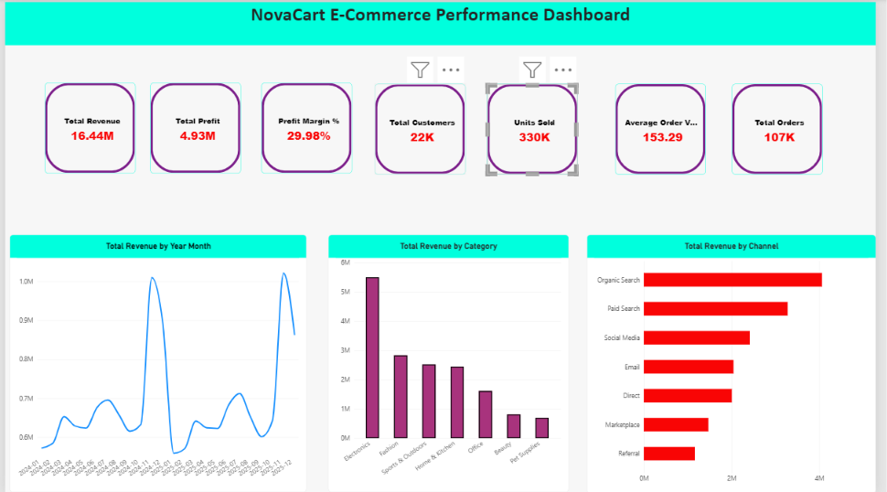
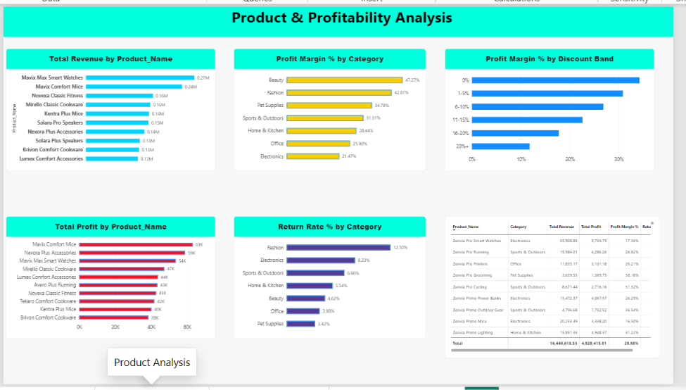
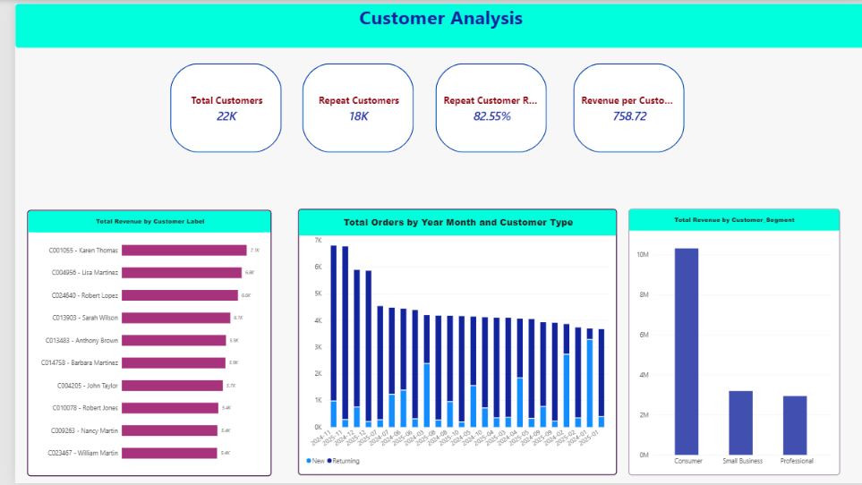
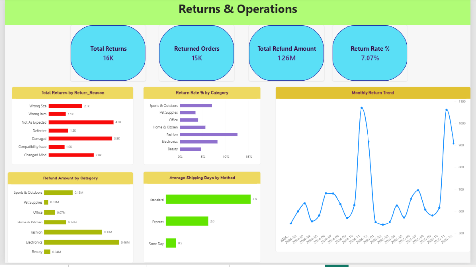

# NovaCart E-Commerce Analytics

An end-to-end **Data Analytics and Business Intelligence project** analyzing e-commerce sales, profitability, customers, products, returns, marketing, and operational performance.

The project demonstrates a complete analytics workflow using:

**Python • Pandas • NumPy • SQL • SQLite • Power BI • DAX • Power Query**

---

## Project Overview

NovaCart is a simulated e-commerce retailer operating across multiple product categories, customer segments, acquisition channels, and geographic locations.

The business needed a consolidated analytical solution to answer questions such as:

- How much revenue and profit is the company generating?
- Which categories and products drive the most revenue?
- Which products generate high sales but weak profitability?
- How do discounts affect profit margins?
- Which customer segments generate the most value?
- What percentage of customers make repeat purchases?
- Which acquisition channels perform best?
- Which categories have the highest return rates?
- How much revenue is being lost through refunds?
- How efficiently are orders being shipped?

The final solution combines **Python data preparation, SQL business analysis, and an interactive Power BI dashboard**.

---

## Key Business KPIs

| KPI | Result |
|---|---:|
| Total Revenue | **$16.44M** |
| Total Profit | **$4.93M** |
| Profit Margin | **29.98%** |
| Completed Orders | **107K** |
| Active Customers | **22K** |
| Units Sold | **330K** |
| Average Order Value | **$153.29** |
| Revenue per Customer | **$758.72** |
| Repeat Customers | **18K** |
| Repeat Customer Rate | **82.55%** |
| Returns | **16K** |
| Returned Orders | **15K** |
| Return Rate | **7.07%** |
| Refund Amount | **$1.26M** |

---

## Business Insights

### Sales & Profitability

- **Electronics** generated the highest overall revenue.
- Revenue and profit show clear seasonal variation, with strong peaks toward the end of the year.
- High revenue does not necessarily mean high profitability; several strong-selling products have lower profit margins.
- Deeper discount levels are associated with progressively lower profit margins.

### Product Performance

- Electronics dominates revenue but operates at a considerably lower margin than categories such as Beauty and Fashion.
- **Beauty** achieved the highest category-level profit margin.
- Product-level analysis identified high-revenue products that should be monitored for margin efficiency.
- Product return rates vary significantly across categories.

### Customer Analytics

- Approximately **82.55% of active customers are repeat customers**, indicating strong repeat purchasing behavior.
- Consumer customers generate the largest absolute share of revenue.
- Customer-level analysis identifies the highest-value customers based on order activity and revenue contribution.
- Returning customers account for a significant portion of monthly transaction activity.

### Returns & Operations

- **Fashion** has the highest category-level return rate.
- Electronics contributes the highest refund value due to its large sales volume.
- Common return reasons include products being different from expectations, damaged items, size issues, and customer preference changes.
- Average shipping performance follows the expected service hierarchy:

| Shipping Method | Average Delivery Time |
|---|---:|
| Same Day | **0.5 days** |
| Express | **2.0 days** |
| Standard | **4.0 days** |

### Marketing

- Organic Search generates the highest sales revenue among acquisition channels.
- Paid Search and Social Media also contribute meaningful revenue.
- Marketing analysis evaluates spend, impressions, clicks, conversion rates, cost per click, and cost per attributed order.

---

## Power BI Dashboard

The final Power BI solution contains four analytical pages.

### 1. Executive Overview

Provides a high-level view of overall business performance.

**Includes:**

- Total Revenue
- Total Profit
- Profit Margin
- Customers
- Orders
- Units Sold
- Average Order Value
- Monthly Revenue Trend
- Revenue by Category
- Revenue by Acquisition Channel



### 2. Product & Profitability Analysis

Focuses on product contribution, margins, discounting, and return behavior.

**Includes:**

- Top 10 Products by Revenue
- Top 10 Products by Profit
- Profit Margin by Category
- Profit Margin by Discount Band
- Return Rate by Category
- Product Performance Table



### 3. Customer Analysis

Explores customer value, retention, and purchasing behavior.

**Includes:**

- Total Customers
- Repeat Customers
- Repeat Customer Rate
- Revenue per Customer
- Top Customers by Revenue
- Revenue by Customer Segment
- New vs Returning Customers
- Customer Performance Table



### 4. Returns & Operations

Analyzes product returns, refunds, and shipping performance.

**Includes:**

- Total Returns
- Returned Orders
- Total Refund Amount
- Return Rate
- Returns by Reason
- Return Rate by Category
- Refund Amount by Category
- Average Shipping Days by Method
- Monthly Return Trend



---

## Data Model

The Power BI model follows a structured relational design.

Main relationships:

```text
Customers
    1
    |
    *
Orders
    1
    |
    *
OrderItems -------- 1 Products
    |
    1
Returns

Date
  |
  *
Orders

Marketing
```

Primary relationships include:

- `Customers[Customer_ID]` → `Orders[Customer_ID]`
- `Orders[Order_ID]` → `OrderItems[Order_ID]`
- `Products[Product_ID]` → `OrderItems[Product_ID]`
- `OrderItems[Order_Item_ID]` → `Returns[Order_Item_ID]`
- `Date[Date]` → `Orders[Order_Date]`

A dedicated Date dimension supports time-intelligence calculations.

---

## Dataset

The project uses a **synthetic but business-realistic e-commerce dataset**.

The data was intentionally designed with meaningful relationships rather than independent random values.

Examples include:

- category-specific product prices and margins
- repeat customer purchasing behavior
- seasonal demand changes
- channel-dependent discounts
- product-category return behavior
- marketing channel differences
- realistic shipping lead times
- linked revenue, cost, discount, and profit calculations

### Cleaned Dataset Size

| Table | Rows |
|---|---:|
| Customers | 25,000 |
| Products | 1,200 |
| Orders | 111,900 |
| Order Items | 227,167 |
| Returns | 16,054 |
| Marketing | 360 |

---

## Data Quality Problems

The raw dataset intentionally included common client-side data problems such as:

- missing values
- duplicate transaction records
- inconsistent capitalization
- leading and trailing whitespace
- city spelling errors
- invalid date values
- negative quantities
- zero prices
- missing product IDs
- inconsistent payment methods
- inconsistent return reasons
- missing marketing metrics

These problems were identified and corrected through Python before analysis.

---

## Python Workflow

Three Jupyter notebooks document the data preparation and analysis process.

### `01_data_quality.ipynb`

Performs the initial data audit:

- row and column inspection
- data type validation
- null analysis
- duplicate detection
- primary-key validation
- foreign-key validation
- invalid date detection
- numeric-rule checks
- categorical consistency checks
- business-rule validation

### `02_data_cleaning.ipynb`

Performs systematic data cleaning:

- standardizes text values
- corrects city names
- handles missing data
- removes duplicate transactions
- repairs quantities and prices
- parses dates
- removes invalid relationships
- recalculates financial fields
- validates cleaned output

### `03_exploratory_analysis.ipynb`

Performs exploratory and business analysis:

- executive KPIs
- monthly revenue trends
- profitability analysis
- product performance
- customer behavior
- repeat customers
- channel analysis
- discount analysis
- return analysis
- geographic analysis
- marketing performance
- shipping performance

---

## SQL Analysis

The cleaned data was loaded into a SQLite database:

```text
sql/novacart.db
```

The SQL analysis includes:

- joins
- aggregations
- CTEs
- CASE expressions
- window functions
- `LAG()`
- `DENSE_RANK()`
- running totals
- month-over-month growth
- year-over-year growth
- 3-month moving averages
- customer ranking
- repeat customer analysis
- product profitability
- return analysis
- marketing analysis
- RFM-style customer segmentation

Main SQL file:

```text
sql/business_analysis.sql
```

Example:

```sql
WITH monthly AS (
    SELECT
        SUBSTR(o.Order_Date, 1, 7) AS Year_Month,
        SUM(oi.Net_Sales) AS Revenue
    FROM orders o
    JOIN order_items oi
        ON o.Order_ID = oi.Order_ID
    WHERE o.Order_Status = 'Completed'
    GROUP BY SUBSTR(o.Order_Date, 1, 7)
)
SELECT
    Year_Month,
    ROUND(Revenue, 2) AS Revenue,
    ROUND(
        (Revenue - LAG(Revenue) OVER (ORDER BY Year_Month))
        * 100.0 /
        NULLIF(LAG(Revenue) OVER (ORDER BY Year_Month), 0),
        2
    ) AS MoM_Growth_Pct
FROM monthly;
```

---

## Power BI / DAX

Examples of DAX measures used in the dashboard:

```DAX
Total Revenue =
SUM(OrderItems[Net_Sales])
```

```DAX
Total Profit =
SUM(OrderItems[Profit])
```

```DAX
Profit Margin % =
DIVIDE(
    [Total Profit],
    [Total Revenue],
    0
)
```

```DAX
Average Order Value =
DIVIDE(
    [Total Revenue],
    [Total Orders],
    0
)
```

```DAX
Return Rate % =
DIVIDE(
    [Returned Items],
    [Sold Items],
    0
)
```

The model also contains calculated columns for discount segmentation and customer behavior.

---

## Project Workflow

```text
Raw CSV Data
      |
      v
Data Quality Audit
      |
      v
Python / Pandas Cleaning
      |
      v
Cleaned Data
      |
      +----------------+
      |                |
      v                v
Exploratory         SQLite
Analysis              |
                      v
                 SQL Analysis
                      |
                      v
               Business Insights
                      |
                      v
                 Power BI
                      |
                      v
            Interactive Dashboard
```

---

## Project Structure

```text
Ecommerce_Analytics_Project/
│
├── data/
│   ├── raw/
│   │   ├── customers.csv
│   │   ├── marketing.csv
│   │   ├── orders.csv
│   │   ├── order_items.csv
│   │   ├── products.csv
│   │   └── returns.csv
│   │
│   └── cleaned/
│       ├── customers_clean.csv
│       ├── marketing_clean.csv
│       ├── orders_clean.csv
│       ├── order_items_clean.csv
│       ├── products_clean.csv
│       └── returns_clean.csv
│
├── notebooks/
│   ├── 01_data_quality.ipynb
│   ├── 02_data_cleaning.ipynb
│   └── 03_exploratory_analysis.ipynb
│
├── sql/
│   ├── create_database.py
│   ├── business_analysis.sql
│   ├── novacart.db
│   └── README_SQL.md
│
├── powerbi/
│   └── NovaCart_Ecommerce_Analytics.pbix
│
├── reports/
│   ├── category_performance.csv
│   ├── channel_performance.csv
│   ├── customer_value.csv
│   ├── marketing_channel_performance.csv
│   ├── monthly_performance.csv
│   ├── product_performance.csv
│   ├── return_rate_by_category.csv
│   ├── sql_01_executive_kpi_summary.csv
│   ├── sql_02_monthly_revenue_profit.csv
│   ├── sql_03_year_over_year_performance.csv
│   ├── sql_04_month_over_month_growth.csv
│   └── sql_05_running_revenue_total.csv
│
├── screenshots/
│   ├── 01_executive_overview.png
│   ├── 02_product_analysis.png
│   ├── 03_customer_analysis.png
│   └── 04_returns_operations.png
│
├── .gitignore
└── README.md
```

---

## How to Run the Project

### 1. Clone the repository

```bash
git clone <repository-url>
cd Ecommerce_Analytics_Project
```

### 2. Create a Python virtual environment

Windows:

```powershell
python -m venv .venv
.venv\Scripts\Activate.ps1
```

### 3. Install Python dependencies

```powershell
pip install pandas numpy matplotlib jupyter ipykernel openpyxl
```

### 4. Run the notebooks

Run in this order:

```text
01_data_quality.ipynb
02_data_cleaning.ipynb
03_exploratory_analysis.ipynb
```

### 5. Build the SQLite database

From the project root:

```powershell
python sql/create_database.py
```

This generates:

```text
sql/novacart.db
```

### 6. Run SQL analysis

Open:

```text
sql/business_analysis.sql
```

using SQLite-compatible software such as:

- SQLTools
- DB Browser for SQLite
- DBeaver

### 7. Open the Power BI dashboard

```text
powerbi/NovaCart_Ecommerce_Analytics.pbix
```

---

## Skills Demonstrated

### Data Analysis
- Data profiling
- Data cleaning
- Exploratory data analysis
- KPI development
- Business analysis
- Customer analysis
- Product analysis
- Profitability analysis

### Python
- Pandas
- NumPy
- Matplotlib
- data validation
- transformation
- aggregation

### SQL
- SQLite
- joins
- CTEs
- CASE
- window functions
- ranking
- running totals
- growth calculations
- segmentation

### Power BI
- Power Query
- relational data modeling
- DAX
- date tables
- KPI measures
- interactive visualizations
- business dashboards

---

## Business Value

This project demonstrates how raw transactional data can be transformed into a decision-support solution that enables management to:

- monitor revenue and profitability
- identify high-value products
- detect margin pressure from discounts
- understand customer retention
- monitor return behavior
- identify operational inefficiencies
- compare acquisition channels
- support data-driven decisions

---

## Tools Used

| Area | Technology |
|---|---|
| Data Cleaning | Python / Pandas / NumPy |
| EDA | Pandas / Matplotlib |
| Database | SQLite |
| Querying | SQL |
| BI & Visualization | Power BI |
| Data Transformation | Power Query |
| Measures | DAX |
| Development | VS Code / Jupyter |

---

## Author

**Didar Ali**
Computer Systems Engineering Graduate
Data Analytics • Power BI • SQL • Python

---

## Portfolio Purpose

This project was developed as an end-to-end portfolio case study demonstrating the workflow expected in real-world data analytics and Power BI client projects:

**messy data → cleaning → validation → SQL analysis → business insights → interactive dashboard**
